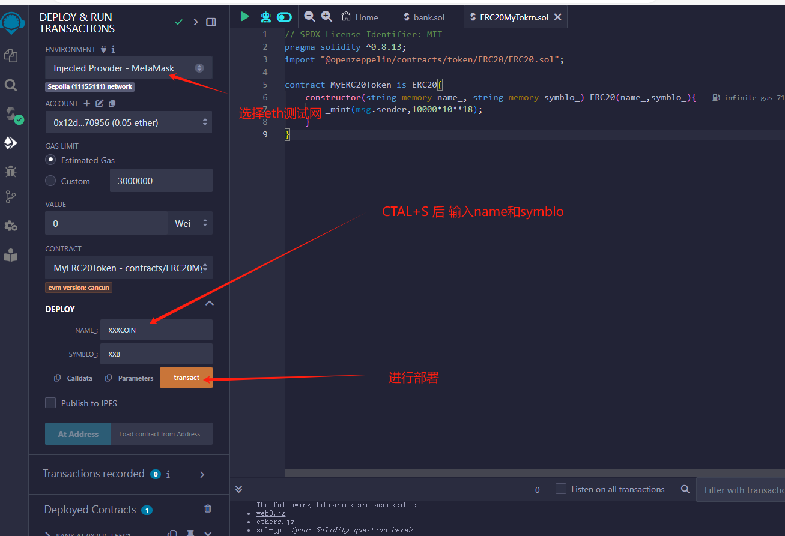
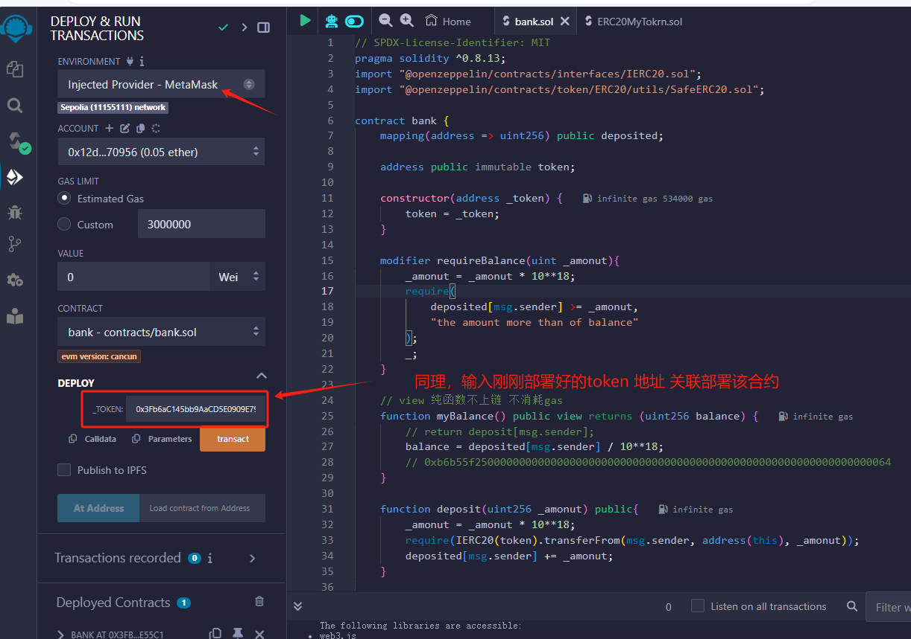

# solidity+react+web3JS 入门实战项目

solidity合约部分上链生产合约abi后，启动react项目，利用web3.js实现交互。
实现功能：token授权，链上合约质押，提取，转账。

## remix+solidity
solidity代码编译部署在remix上执行，在eth sepolia测试网上部署
1/
2/

In the project directory, you can run:
### react部分
可安装依赖`npm install` `yarn install`
直接运行`npm start`
执行react项目 前端界面执行
Runs the app in the development mode.\
Open [http://localhost:3000](http://localhost:3000) to view it in your browser.

The page will reload when you make changes.\
You may also see any lint errors in the console.

####
本项目学习参考 b站up IT老炮-仁科
记录学习部分，并做了部分优化，新增了授权按钮，原up授权操作需要remix中执行，本项目中将授权按钮放到页面执行，转账前先校验是否有授权，可自动和手动在页面中发起授权